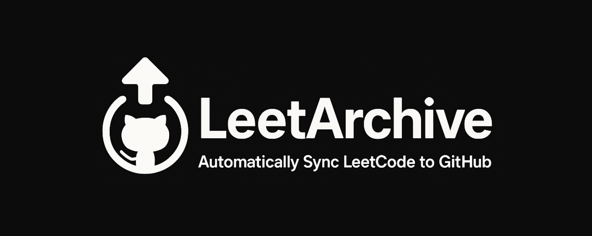

<h1 align="center">
  <a href="https://github.com/anujlunawat/LeetArchive-Extension"></a>
  <br>
  <a href="https://github.com/anujlunawat/LeetArchive-Extension">LeetArchive</a> - Automatically sync your LeetCode solutions to GitHub
  <br>
  <br>
</h1>

<p align="center">
  <a href="https://github.com/anujlunawat/LeetArchive-Extension/blob/main/LICENSE.txt">
    
  </a>
  
  
  
</p>


## What is LeetArchive?
<p>A <a href="https://chromewebstore.google.com/detail/leetarchive/egpghjhndnglogkappfmfokomolppmln">Chrome extension</a> that automatically pushes your LeetCode solutions to GitHub when you solve a problem. It helps you maintain a portfolio of your coding interview preparation and track your progress.
  <br>It's forked from <a href="https://github.com/arunbhardwaj/LeetHub-2.0">LeetHub-2.0</a> which is not compatible with Leetcode anymore since the latest updates, and inspired by
  <a href="https://github.com/raphaelheinz/LeetHub-3.0">LeetHub-3.0</a></p>

## Why LeetArchive?
<p> <strong>1.</strong> Build your coding portfolio effortlessly<br>
Recruiters value seeing your problem-solving skills and contributions. LeetArchive automatically creates a GitHub repository showcasing your LeetCode journey, making it easy to demonstrate your skills.</p>

<p> <strong>2.</strong> Track your progress in one place<br>
No more manual copying of solutions! LeetArchive automatically organizes your solutions by difficulty and topic, making it easy to review and track your progress.</p>

## How does LeetArchive work?     

<p>It's simple:</p>
<ol>
  <li>Install the extension from Chrome Web Store: <a href="<a href="https://chromewebstore.google.com/detail/leetarchive/egpghjhndnglogkappfmfokomolppmln">[LINK]</a></li>
  <li>Authorize with GitHub to set up your account</li>
  <li>Create or link an existing repository (private by default)</li>
  <li>Start solving problems on LeetCode - LeetArchive will automatically sync your solutions!</li>
</ol>

## Features
- Automatic solution syncing
- Organized by difficulty (Easy, Medium, Hard)
- Categorized by topics
- Private repository by default
- Detailed problem descriptions
- Solution notes support
- Progress tracking

## Installation

1. **Chrome Web Store**: <a href="https://chromewebstore.google.com/detail/leetarchive/egpghjhndnglogkappfmfokomolppmln">*[LINK]*</a>

2. **Manual installation**
    You can also install the plugin manually. Please follow the steps below:
    * Create your own OAuth app in GitHub (https://github.com/settings/applications/new) and store CLIENT_ID and CLIENT_SECRET confidentially
        * Application name: [CUSTOM]
        * Homepage URL: https://github.com/anujlunawat/LeetArchive
        * Authorization callback URL: https://github.com/
    * Download the project <a href="/anujlunawat/LeetArchive/archive/refs/heads/main.zip">ZIP</a> or clone this repository
    * Run ```npm run setup``` to install the developer dependencies
    * Update CLIENT_ID and CLIENT_SECRET in ```src/js/authorize.js``` and ```src/js/oauth2.js``` with your ids
    * Go to <a href="chrome://extensions">chrome://extensions</a>
    * Enable Developer mode by toggling the switch on top right corner
    * Click **"Load unpacked"**
    * Select the entire LeetArchive folder

## Setup

1. After installing LeetArchive, launch the extension
2. Click on "Authorize with GitHub" to set up your account
3. Setup an existing/new repository with LeetArchive (private by default) by clicking "Get Started"
4. Begin Leetcoding! To view your progress, simply click on the extension!

## Manual Synchronization

### When to use manual sync
Your solution may not be successfully synced to GitHub if you update the text in the editor too quickly after submission.
It is necessary to wait for 4 seconds (until the spinner stops) after submitting the solution before entering new characters, switching languages, or switching editors.
During this period, your solution is being pushed to GitHub, and the website should maintain its layout without alteration.

### How to use manual sync previous submissions
   - Navigate to the submission you want to sync
   - Select the submission from the list
   - Click the manual sync button
   - Wait for the sync to complete
     
### Note
While the manual sync process is less than ideal, it provides a reliable backup when automatic sync fails. We're continuously working to improve the sync reliability. If you find a better solution, your contributions are welcome!

## Contributing

Please help to further improve this awesome extension! We would appreciate your support. Your pull requests are welcome!

Don't forget to star this repository for further development of new features. If you want a particular feature, simply create an issue to request it!

## License

This project is licensed under the MIT License - see the [LICENSE.txt](LICENSE.txt) file for details.
